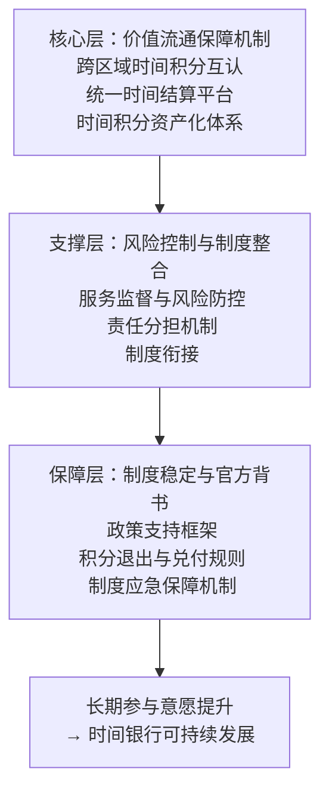

```mermaid
graph TD

A[核心层：价值流通保障机制<br/>跨区域时间积分互认<br/> 统一时间结算平台<br/>时间积分资产化体系]

B[支撑层：风险控制与制度整合<br/> 服务监督与风险防控<br/> 责任分担机制<br/> 制度衔接]

C[保障层：制度稳定与官方背书<br/> 政策支持框架<br/> 积分退出与兑付规则<br/> 制度应急保障机制]

D[长期参与意愿提升<br/>→ 时间银行可持续发展]

A --> B
B --> C
C --> D
```